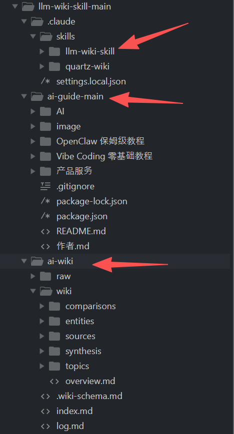
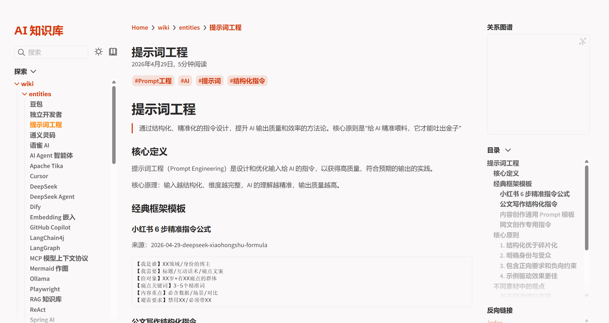

# LLM Wiki - 个人 AI 知识库系统

基于 [Karpathy llm-wiki]方法论，利用 AI 持续构建和维护你的个人知识库。支持从多种素材源（网页、推特、公众号、小红书、知乎、YouTube、PDF、本地文件）自动整理为结构化的 wiki，并通过 Quartz 发布为静态wiki知识库网站。 并通过 claude_agent_sdk 调用 claude agent 使用 llm-wiki ,提供api接口对外访问服务 。

Claude Agent SDK + LLM-wiki，最强大的agentic RAG 。 本项目主要展示了我制作的 llm-wiki 怎样通过 Claude Agent SDK 转为 agentic rag， 效果非常好的。 核心文件是： 7_wiki_writer.py ， wiki_writer_api.py 。

## 🤔 什么是 LLM-wiki？
LLM Wiki：用大语言模型把你的零散知识，自动整理成一部结构化的“个人百科全书”。传统的做法是，每次你想问 AI 一个问题，AI 都要重新翻一遍你的所有资料，找到相关的再回答你（这叫 RAG，检索增强生成）。这就好比你每次问图书管理员一个问题，他都要把整个图书馆的书重新翻一遍。Karpathy 说，这太蠢了。正确的做法是：让 AI 当一个“知识编译器”，先把你的所有资料读一遍，整理成一本结构清晰、彼此关联的百科全书。以后你再提问，AI 直接翻这本百科书就行了。

原来的RAG系统的完整链路是这样的：ingest → chunk → index → retrieve → rerank → prompt-pack → generate → cite ， Karpathy 大神的确非常深刻，过去几年最重要的ai概念都是他总结出来，都是看起来很简单，但是达到了最本质。llm wiki被大大低估了，这个东西就是开发ai的根。 我给你看看， 其实k大神的意思是这些， 这个wiki格式是非常重要，ai就是靠这个组织了整个知识 所以，它一下子解决了rag全部问题，我已经不再用rag了，因为这个才是答案。 除了rag，它可以一键生成wiki网站，真正的知识库 幸好我测试多个，现在知道这个好东西，基于这个东西，我可以搞很多厉害的项目，因为 理解越深，生成越深，本质就是这样搞ai 。 目前项目的wiki文件夹就是放wiki资料的地方，我暂时放了 鱼皮大牛 写的一些开源文章，用来测试效果。

项目参考了优秀的开源项目：
https://github.com/kenneth-liao/claude-agent-sdk-intro ，
https://github.com/sdyckjq-lab/llm-wiki-skill


特别感谢佬友：https://linux.do/

## 三大核心能力

### 1. LLM Wiki Skill — 知识库构建

利用 Claude Code 的 Skill 机制，让 AI 自动完成知识库的采集、整理、质量控制和维护。

**支持的工作流：**

| 工作流 | 说明 |
|--------|------|
| `init` | 初始化新知识库，创建目录结构和配置 |
| `ingest` | 消化单篇素材（URL / 文件 / 粘贴文本），自动提取实体和主题 |
| `batch-ingest` | 批量处理多文件（.md / .txt / .pdf / .html） |
| `query` | 查询知识库，返回带来源引用的综合回答 |
| `digest` | 深度综合报告，跨素材分析特定主题 |
| `lint` | 健康检查：孤立页面、断链、内容质量 |
| `status` | 查看知识库状态：来源分布、页面统计、近期活动 |
| `graph` | 生成 Mermaid 知识图谱，可视化实体关系 |

**支持的素材源：**

| 类型 | 提取方式 |
|------|---------|
| 网页文章 | `baoyu-url-to-markdown` |
| X / Twitter | `baoyu-url-to-markdown` |
| 微信公众号 | `wechat-article-to-markdown` |
| YouTube | `youtube-transcript` |
| 知乎 | `baoyu-url-to-markdown` |
| PDF | 直接读取 |
| 本地文件 (.md / .txt) | 直接读取 |

**知识库目录结构：**

```
ai-wiki/
├── .wiki-schema.md      # 知识库配置和质量标准
├── index.md             # 内容索引
├── log.md               # 操作日志
├── overview.md          # 快速导航
├── raw/                 # 原始素材
│   ├── articles/        # 网页文章
│   ├── tweets/          # 推特内容
│   ├── wechat/          # 公众号文章
│   ├── xiaohongshu/     # 小红书内容
│   ├── zhihu/           # 知乎内容
│   ├── pdfs/            # PDF 文件
│   └── notes/           # 笔记和文本
└── wiki/                # 结构化 wiki 内容
    ├── entities/        # 实体页（工具、概念、人物）
    ├── topics/          # 主题页（研究领域）
    ├── sources/         # 来源摘要
    ├── comparisons/     # 对比分析
    └── synthesis/       # 综合分析
```

**详细使用步骤：**

❯ ai-guide 是 收集回来的资料， 现在需求为 需要你利用 llm-wiki skill 对这些资料进行分析整理成wiki,请你完成



### 2. Quartz Wiki Skill — 静态网站部署

将生成的知识库通过 [Quartz v4](https://quartz.jzhao.xyz/) 发布为美观的静态网站。

**特性：**
- 双向链接和关系图谱
- 全文搜索
- 响应式设计，支持亮色/暗色主题
- 支持部署到 Cloudflare Pages / Vercel / GitHub Pages

**配置文件：** `quartz/quartz.config.ts`

```bash
# 本地预览
cd quartz
npx quartz build --serve

# 构建生产版本
npx quartz build

# 部署到 Cloudflare Pages
npx wrangler pages deploy public
```


**claude code里面详细使用skill步骤：**

❯ 请利用 quartz-wiki skill 把 ai-wiki 制作成 quartz网站

当前部署地址：`http://wikilego.liangdabiao.com/`


### 3. Claude Agent SDK — 对外服务

通过 [Claude Agent SDK](https://docs.claude.com/en/api/agent-sdk/python) 将知识库能力封装为可编程调用的 AI Agent。

#### CLI 模式 (`7_wiki_writer.py`)

Agent 会自动识别用户意图，调用 llm-wiki-skill 完成知识库操作（查询、消化素材、生成文章等）。

```bash
# 单次请求
.\.venv\Scripts\python.exe -B 7_wiki_writer.py -r "帮我写一篇关于 AI Agent 的综合文章"

# 交互式模式（连续对话）
.\.venv\Scripts\python.exe -B 7_wiki_writer.py -i
```

#### API 模式 (`wiki_writer_api.py`)

基于 FastAPI 的 HTTP 服务，支持 SSE 流式响应和同步 JSON 响应。

```bash
# 启动服务
.\.venv\Scripts\python.exe -B wiki_writer_api.py

# 或使用 uvicorn（支持热重载）
.\.venv\Scripts\uvicorn.exe wiki_writer_api:app --host 0.0.0.0 --port 8000 --reload
```

**API 端点：**

| 方法 | 路径 | 说明 |
|------|------|------|
| GET | `/health` | 健康检查 |
| POST | `/api/v1/wiki/generate` | 流式生成 (SSE) |
| POST | `/api/v1/wiki/generate/sync` | 同步生成 (JSON) |

**请求示例：**

```bash
# 同步模式
curl -X POST http://localhost:8000/api/v1/wiki/generate/sync \
  -H "Content-Type: application/json" \
  -d '{"request": "分析知识库中关于 Agent 的内容"}'

# 流式模式 (SSE)
curl -X POST http://localhost:8000/api/v1/wiki/generate \
  -H "Content-Type: application/json" \
  -d '{"request": "帮我消化这篇 https://example.com/article"}'
```

**响应格式（同步）：**

```json
{
  "success": true,
  "content": "生成的文章内容...",
  "model": "deepseek-v4-flash",
  "request": "分析知识库中关于 Agent 的内容"
}
```

---

## 快速开始

### 环境要求

- **Python 3.13+**（必须）
- **uv**（Python 包管理器，[安装指南](https://docs.astral.sh/uv/getting-started/installation/)）
- **Claude Code**（`npm install -g @anthropic-ai/claude-code`）
- **Node.js**（Quartz 构建和 API 服务需要）

### 安装

```bash
# 1. 克隆项目
git clone <repository-url>
cd llm-wiki-skill-main

# 2. 安装 Python 依赖（uv 自动创建 .venv 虚拟环境）
uv sync

# 3. 配置环境变量
cp .env.example .env
# 编辑 .env，填入你的 API 配置
```

### 环境变量配置

编辑 `.env` 文件，根据你使用的 API 选择一种配置：

**使用 Anthropic 官方 API：**

```env
ANTHROPIC_AUTH_TOKEN=sk-ant-your_key_here
ANTHROPIC_BASE_URL=https://api.anthropic.com
MODEL=claude-sonnet-4-20250514
```

**使用 DeepSeek 等兼容接口：**

```env
ANTHROPIC_AUTH_TOKEN=your_deepseek_key
ANTHROPIC_BASE_URL=https://api.deepseek.com/anthropic
MODEL=deepseek-v4-flash
```

### 验证安装

```bash
# 检查 Python 版本（必须 3.13+）
.\.venv\Scripts\python.exe --version

# 检查 SDK 版本（必须是 0.1.1）
.\.venv\Scripts\python.exe -B -c "import claude_agent_sdk; print(claude_agent_sdk.__version__)"

# 测试 CLI 模式
.\.venv\Scripts\python.exe -B 7_wiki_writer.py -r "你好"
```

### 使用知识库

在 Claude Code 中进入项目目录，直接用自然语言操作：

```
# 初始化知识库
"帮我初始化一个关于 AI 的知识库"

# 添加素材
"帮我消化这篇 https://example.com/article"

# 查询知识库
"关于 RAG 技术，我的知识库里有什么？"

# 健康检查
"检查一下知识库的状态"
```

---

## 关于 Python 版本管理

项目要求 Python 3.13+。推荐使用 `uv` 管理，它会自动创建 `.venv` 虚拟环境，无需手动切换 Python 版本：

```bash
# 所有命令通过 .venv 执行（-B 跳过字节码缓存加速启动）
.\.venv\Scripts\python.exe -B 7_wiki_writer.py -r "你的请求"
.\.venv\Scripts\python.exe -B wiki_writer_api.py
```

如果你使用 **pyenv**，`.python-version` 写的是 `3.13`，但 pyenv 需要完整版本号：

```bash
pyenv install 3.13.7
pyenv local 3.13.7
```

> **Windows 启动慢？** 首次运行时 `mcp` 包需要编译大量字节码（`.pyc`），在 Windows 上可能耗时 1-2 分钟。加 `-B` 参数可跳过字节码缓存，显著加速启动。

---

## 常见问题

### SDK connect() 卡死无响应

**症状：** 运行脚本后显示面板信息，但一直卡在 "正在分析请求" 没有响应。

**原因：** `claude-agent-sdk` 0.1.7x 版本在 Windows + Python 3.13 环境下存在 `anyio.to_thread.run_sync` 死锁 bug。

**解决：** 确认 SDK 版本为 `0.1.1`（已锁定在 `pyproject.toml`）：

```bash
.\.venv\Scripts\python.exe -B -c "import claude_agent_sdk; print(claude_agent_sdk.__version__)"
# 必须输出 0.1.1
```

如果版本不对，重建虚拟环境：

```bash
rmdir /s /q .venv
uv sync
```

### receive_response() 不终止（Python 3.11 及以下）

在 Python 3.11 上，使用 DeepSeek 等第三方端点时，SDK 的 `receive_response()` 不会自动终止。升级到 Python 3.13 后自动解决。

### uv run 无响应

`uv run` 可能卡在依赖解析或安装。直接使用 `.venv` 中的 Python：

```bash
.\.venv\Scripts\python.exe -B your_script.py
```

### ImportError: No module named 'fastapi'

API 模式需要额外依赖，运行 `uv sync` 安装：

```bash
uv sync
```

---

## 项目结构

```
llm-wiki-skill-main/
├── .claude/
│   └── skills/
│       ├── llm-wiki-skill/       # 知识库构建 Skill
│       │   ├── SKILL.md           # Skill 定义和工作流
│       │   ├── scripts/           # 辅助脚本
│       │   └── templates/         # 页面模板
│       └── quartz-wiki/           # 静态网站部署 Skill
│           └── SKILL.md
├── ai-wiki/                      # 知识库数据
│   ├── raw/                     # 原始素材
│   └── wiki/                    # 结构化 wiki 内容
├── quartz/                       # Quartz 静态站点
├── 7_wiki_writer.py              # SDK CLI 工具
├── wiki_writer_api.py            # SDK API 服务
├── pyproject.toml                # Python 依赖
├── .env.example                  # 环境变量模板
└── .gitignore
```

## 质量标准

知识库遵循严格的质量规范：

- **实体页**：至少 1500 字，禁止占位符文本，必须标注来源
- **来源摘要**：必须包含"实践内容"和"摘录"部分
- **主题页**：至少 5 个核心要点，需要知识结构
- **链接一致性**：所有 `[[链接]]` 必须与实际文件名匹配
- **中英双语**：支持中文和英文，文件路径保持一致

## 参考资料

- [Claude Agent SDK 文档](https://docs.claude.com/en/api/agent-sdk/python)
- [Claude Agent SDK 教程](https://github.com/kenneth-liao/claude-agent-sdk-intro)
- [Quartz v4 文档](https://quartz.jzhao.xyz/)
- [Karpathy llm-wiki](https://github.com/karpathy/llm-wiki)
