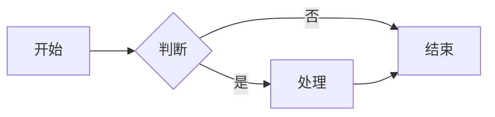
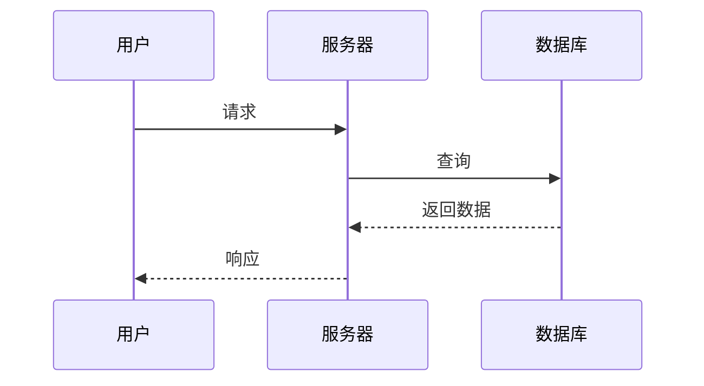
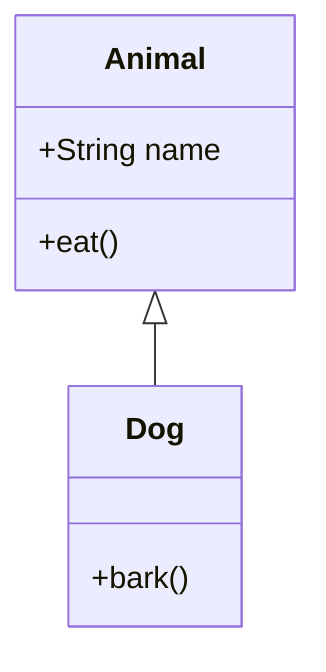
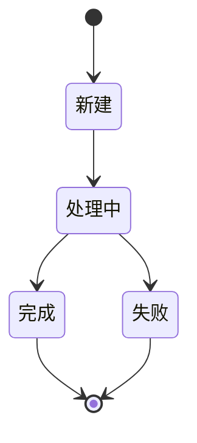
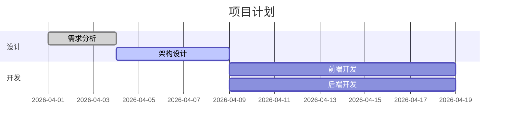
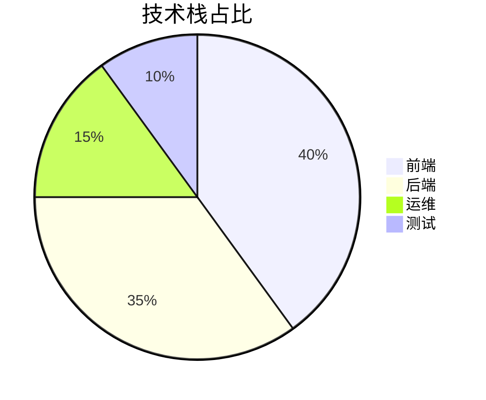

# Mermaid 作图

> 基于文本的图表生成工具，支持流程图、架构图、时序图等

## 简介

Mermaid 是一种基于文本的图表描述语言，能够将简单的文本描述渲染成各种专业图表。它与 AI 配合使用效果极佳，AI 可以快速生成 Mermaid 代码，无需人工绘制，是技术文档作图的标准工具。

## 支持的图表类型

### 1. 流程图（Flowchart）

### 2. 序列图（Sequence Diagram）

### 3. 类图（Class Diagram）

### 4. 状态图（State Diagram）

### 5. 甘特图（Gantt Chart）

### 6. 饼图（Pie Chart）

## 不同素材中的观点

来自 [[2026-04-29-yupi-ai-guide-tools]]：
- 技术文档作图的标准方法：豆包 + Mermaid
- 流程图、架构图自动化生成流程
- 把作图信息提供给豆包或其他 AI
- AI 生成 Mermaid 文本语法
- 下载图片或放入渲染工具

来自 [[2026-04-29-ai-architecture-diagram-tutorial]]：
- 架构图是程序员的第二语言，核心竞争力
- Mermaid 是程序员 AI 绘图的 5 大方法之一
- 优势：完全代码化，与代码库同步维护
- 劣势：表达能力有限，复杂图吃力

## AI + Mermaid 工作流

### 自动化生成流程
1. **需求描述**：把作图信息提供给 AI（如豆包、DeepSeek）
2. **AI 生成代码**：AI 根据需求生成 Mermaid 文本语法
3. **渲染查看**：在支持的工具中渲染查看效果
4. **迭代优化**：用自然语言描述修改需求，AI 自动调整

### 支持 Mermaid 的工具
- **Obsidian**：原生支持，即时渲染
- **VS Code**：安装 Markdown Preview Enhanced 插件
- **GitHub**：上传后自动渲染
- **Typora**：直接打开渲染
- **语雀**：内嵌支持
- **Mermaid Live Editor**：在线编辑工具

## 实用信息

### 与 AI 配合的最佳实践

#### 1. 明确图表类型
告诉 AI 需要什么类型的图表：
- "用 Mermaid 画一个系统架构流程图"
- "生成一个用户登录时序图"
- "画一个项目进度甘特图"

#### 2. 提供关键信息
- 涉及的节点/角色
- 主要流程和关系
- 关键数据或比例
- 风格偏好

#### 3. 迭代优化
先用 AI 生成初稿，再逐步调整：
- "把这个流程改得更详细"
- "添加一个错误处理分支"
- "调整颜色和布局"

### 未来趋势
Gemini 已原生支持多模态图文混排，未来可能根据代码直接生成完整有图有文的技术方案，Mermaid 作为中间层可能被更高级的多模态生成替代。

## 相关页面
- [[AI创意设计]]
- [[语雀 AI]]
- [[DeepSeek]]
- [[豆包]]
